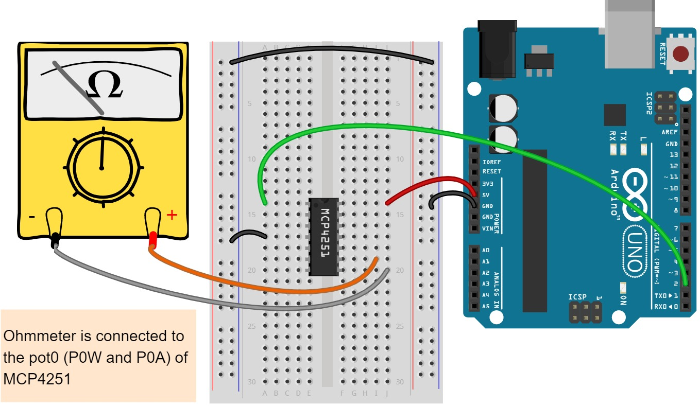

<p align="center">
  <h2 align="center">MCP4351</h2>
  <p align="center">
    Arduino library for MCP4351 Digital Potentiometer    
  </p>
</p>

---
<br />

## Table of Contents

- [About](#about)
- [Features](#features)
- [Installation](#installation)
  - [First method](#first-method)
  - [Second method](#second-method)
- [Functions](#functions)
- [Usage](#usage)
- [Documentation](#documentation)
- [Contributing](#contributing)
- [License](#license)
- [Contact](#contact)
- [Acknowledgment](#acknowledgment)
- [Citation](#citation)


## About

This library can be used for interfacing and controlling the MCP4351 IC with the Arduino. The MCP4351 IC is a volatile, 8-bit (257 wiper steps) digital potentiometers with an SPI compatible interface. It is available with end-to-end resistor values of 5KΩ, 10KΩ, 50kΩ and 100KΩ. More information on the [product page](https://www.microchip.com/wwwproducts/en/MCP4351).Other MCP43xx family ICs can also be used, but full functionality of the library may not be guaranteed.


## Features

- All available controls as per [MCP4351 datasheet](https://ww1.microchip.com/downloads/en/DeviceDoc/22060b.pdf).
- Additional functions like `DigitalPotResistanceToPosition` and `DigitalPotPositionToResistance`.
- Simple to use.
- Multiple MCP4351 ICs can be interfaced and controlled, subjected to the availability of I/O pins on Arduino board.


## Installation

### First method

1. Navigate to the [Releases page](https://github.com/SpyrosCPT/MCP4351/releases).
2. Download the latest release.
3. Extract the zip file
4. In the Arduino IDE, navigate to Sketch > Include Library > Add .ZIP Library


## Functions

- Set wiper position

```
- DigitalPotWiperIncrement
- DigitalPotWiperDecrement
- DigitalPotSetWiperPosition
- DigitalPotSetWiperMin
- DigitalPotSetWiperMax
- DigitalPotSetWiperMid
- DigitalPotReadWiperPosition
```

- Set control registers

```
- DigitalPotReadTconRegister
- DigitalPotReadStatusRegister
- DigitalPotWriteTcon0Register
- DigitalPotWriteTcon1Register
```

- Enable/disable connections

```
- DigitalPotStartup
- DigitalPotShutdown
- DigitalPotTerminalBConnect
- DigitalPotTerminalBDisconnect
- DigitalPotTerminalAConnect
- DigitalPotTerminalADisconnect
- DigitalPotWiperConnect
- DigitalPotWiperDisconnect
- DigitalPotInitTcon
```

- Additional

```
- DigitalPotResistanceToPosition
- DigitalPotPositionToResistance
```

## Usage

Two examples are available in library. Following is the simple example of interfacing a single MCP4351 with the Arduino. 4 potentiometers (pot0-pot3) are controlled and wipers are varied between 0 and 255.



```cpp
#include <MCP4351.h>

#define chipSelectPin 53
#define pot0ResistanceRmax 10000 // These resistance values may vary
#define pot0ResistanceRmin 0
#define pot1ResistanceRmax 10000
#define pot1ResistanceRmin 0
#define pot2ResistanceRmax 10000 // These resistance values may vary
#define pot2ResistanceRmin 0
#define pot3ResistanceRmax 10000
#define pot3ResistanceRmin 0

#define MAX_NUMBER_OF_POTS  4
#define MAX_POT_POSITION    255

MCP4351 digitalPot(chipSelectPin, pot0ResistanceRmax, pot0ResistanceRmin, pot1ResistanceRmax, pot2ResistanceRmin,pot2ResistanceRmax, pot2ResistanceRmin, pot3ResistanceRmax, pot3ResistanceRmin);

uint8_t pot_num = 0;
uint16_t pot_pos;

void setup()
{
    digitalPot.begin();
    for(pot_num = 0; pot_num < MAX_NUMBER_OF_POTS; pot_num++)
    {
        digitalPot.DigitalPotStartup(pot_num);
    }
}

void loop()
{
    for(pot_pos = 0; pot_pos < MAX_POT_POSITION; pot_pos++)
    {
        for(pot_num = 0; pot_num < MAX_NUMBER_OF_POTS; pot_num++)
        {
            digitalPot.DigitalPotSetWiperPosition(pot_num, pot_pos);
        }
        delay(50);
    }
}
```


## Documentation

The documentation is available at https://kulbhushanchand.github.io/MCP4351/


## Contributing

Any contributions you make are greatly appreciated. You can contribute to this project in the following ways :

- Add new functionality
- Review code
- Raise issues about bugs/features/doubts
- Proof-read the documentation
- Cite if used in a publication
- Star on GitHub
- Share with others

Please note that this project is released with a [Contributor Code of Conduct](https://github.com/SpyrosCPT/MCP4351/blob/master/CODE_OF_CONDUCT.md). By contributing to this project you agree to abide by its terms.


## License

This project is distributed under the `GPLv3` License. See [LICENSE](https://github.com/SpyrosCPT/MCP4351/blob/master/LICENSE) for more information.


## Acknowledgment

This project was based entirely off kulbhushanchand's MCP4351 project. I have just extended it to use 2 extra potentiometers.
You can view his project here: https://github.com/kulbhushanchand/MCP4251.

The open-source tools used in development of this project.

- [drawio-desktop](https://github.com/jgraph/drawio-desktop) is used to create logo and diagrams.
- [Fritzing](https://fritzing.org/) is used to create the connection diagram.
